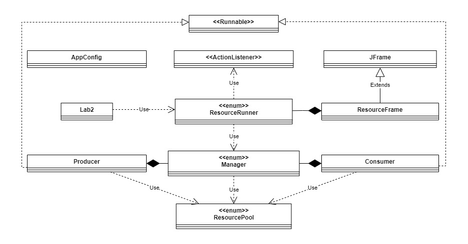

# Laboration 2

## Environment & Tools
### Hardware
- Processor: AMD Ryzen 7 5800H - 3.20 GHz
- Installed RAM: 16,0 GB
- System type: 64-bit operating system, x64-based processor - Windows 11
- NVIDIA GeForce RTX 3060 Laptop GPU
- NVMe SAMSUNG MZVLQ512 - 475GB
### Software
- **Vs Code** version 1.93.1
- **Git** version 2.43.0.windows.1
- **Git Bash**
- **Bitbucket**
- **Apache Maven** version 3.9.6
- **Windows**
    - Edition Windows 11 Home
    - Version 23H2
    - OS build 22631.4169
    - Experience Windows Feature Experience Pack 1000.22700.1034.0
- **Java**:
    - openjdk version "21.0.2" 2024-01-16 LTS
    - OpenJDK Runtime Environment Temurin-21.0.2+13 (build 21.0.2+13-LTS)
    - OpenJDK 64-Bit Server VM Temurin-21.0.2+13 (build 21.0.2+13-LTS, mixed mode, sharing)

## Purpose
The goal of this lab is to design and implement a graphical user interface (GUI) application that simulates a shared resource pool using the producer/consumer pattern. The program will manage resources dynamically, adjusting the number of producers and consumers based on the current pool size. This assignment emphasizes thread-safe operations, atomic actions, and the use of pull notifications for managing concurrency.

### Concrete Goals

- **Producer/Consumer Management**: Implement producers and consumers that add/remove resources from a shared pool at randomized intervals and amounts.
- **Dynamic Actor Adjustment**: Adjust the number of producers and consumers based on the current resource pool level.
- **Atomic Operations**: Ensure that interactions with the resource pool are thread-safe, handling concurrency issues appropriately.
- **GUI Implementation**: Design a GUI that visualizes the resource pool, showing its changes through color based on resource levels.
- **Simulate a Balanced Resource System**: Ensure that the system dynamically balances actors to maintain a healthy resource pool.

## Procedures

This section describes the step-by-step approach used to develop the program. The program relies on four main classes working in tandem to ensure proper functionality:

- **The resource pool**. This is the central point of the program, the class that is interacted with by all of the other main classes. It holds the resources and provides data for the GUI, where the size of the pool is dynamically visualized as resources are added or consumed.
- **Producer and consumer classes**. These are the clients that directly interacts with the resource pool, consuming or producing resources. Both are concrete implementations of the abstract class ``Client``, who in turn implements the ``Runnable`` interface.
- **The manager class**. This is the class that controls the flow of the program, balances the amount of actors and is responsible for updating the GUI as the resource pool changes. For this to be possible it needs to observe the pool ensure accurate updates to the GUI.

In addition to this, three other classes have been implemented to support the functionality. These are:
- **AppConfig class**. A public final utility class to prevent sub-classing, with a private constructor to block instantiation. It holds all relevant data as static final variables for application-wide configuration.
- **ResourceRunner class**. This is the initiation class of the whole setup, its ``runResourceProgram`` method is called by the ``Lab2`` entry point class. Its responsibility is to set up the GUI, start threads through the manager and uses Swing's ``Timer`` class to let the  ``ResourceFrame`` redraw the GUI, feeding it the updated resource pools size and active clients on a set interval.
- **ResourceFrame class**. This class extends JFrame, sets up and redraws the GUI.

So by this description the entirety of the program can be depicted like in the simplified UML diagram below:

Since the ResourceRunner class basically have been covered already lets start to dive in a little deeper into the manager class.

### Manager
So the main functionality of this enum singleton needs to be to start and manage the threads that modify the resource pool. To dynamically modify the clients it needs to pull information about the current pool size.

It's already established that the initial threads have been initiated and started through the runner class, so lets move on to the actual modifying of these clients.
So, a ``modifyClients`` method is employed that utilizes a helper method inside the class. This is the method that the ResourceRunner runs inside the ``swing Timer`` every 150ms.
In this method the current size of the resource pool needs to be retrieved at each iteration. So that is what's gonna happen first of all. After that, that number will be checked against a variable that holds the old pool size (or the starting size for the first iteration). If the numbers don't match that indicates a change have been made and the clients count might need modification (since the threads modify the pool on a random interval on a minimum of 1 second this means it's not sure there has been a change since the last time this method was iterated over, so this mechanisms prevents unnecessary computations from taking place).

When a change have been made to the pool size the clients lists should be modified and threads paused, resumed or created depending on circumstances. Before the execution ends to wait for the next iteration of the method, the ``oldPoolSize`` variable is updated to reflect the current size that was polled at the start of the method execution.

The ``modifyClients`` method checks if the thresholds for the pool have been reached. If not, nothing happens and the current amount of clients keep on interacting with the pool. If either the low or high threshold is breached, the amount of active producers and consumers should be modified. This is done within the helper method ``modifyClientLists``.

So, this method demands some more intricate explanation. It uses four lists for switching between active and sleeping clients. The reason for this is to minimize the creation and destroying of threads. It will dynamically grow the number of needed clients in the system till it hit the cap of 22. Amount of active clients will always be 11, so the other 11 clients in the scenario where maximum capacity is reached will be sleeping. And sleeping threads consume negligible CPU resources, as they are not actively executing code. However, they still occupy a small amount of memory and require a thread object to exist in the JVM, which is a reasonable tradeoff for improved efficiency.

To achieve this, once a threshold is reached, let's say the lower threshold - which indicates a consumer needs to be replaced with a producer, an initial if-block needs to check if there are active consumers (so the program wont attempt to remove a consumer when all already been removed, just to protect against edge cases), and if so the first active consumer in the list gets interrupted, which will put it into a sleep state, effectively halting it's execution. Then that same thread is moved from the active list to the sleeping list.

Next up is adding a producer. The first thing that needs to happen is to check if the active producers list have fewer producers than the number of allowed maximum of active clients (11). This is what creates the cap of a maximum of 22 client threads in the system. After this, the list of sleeping producers need to be checked to ensure we have producers to switch from there to the active list. This is what enables the system to stay away from creating threads when it is not needed.

So if a sleeping producer exist, the first one is moved to the active list, and the thread is interrupted to wake it up, allowing it to resume producing resources. However, if the sleeping producers list is empty, a new thread must be created. This thread is initialized with the producer, which implements the Runnable interface, and started.

And that's it for the ``Manager`` singleton.

### Producers/consumers
Producers and consumers in this system operate dynamically by transitioning between active and sleeping states as described above. When a thread is actively producing or consuming resources, it performs this task in a while loop, sleeping for randomized short intervals between modifying the resource pool to simulate processing delays or something. However, when resource thresholds are reached - for example, if too many resources exist - producers are temporarily moved to a sleeping state to balance system performance and avoid redundant work.

These state transitions are triggered using multiple interrupts and nested sleep states. When a producer is interrupted, it catches the InterruptedException and enters a long sleep state, effectively halting its execution. At this point, the producer is removed from the active list and added to the sleeping list as described in the section above. Sleeping threads consume negligible system resources, as they are not executing any code, but they remain available for reuse, avoiding the overhead of thread creation.

When resources dip below the threshold, producer are awakened by another interrupt. This interrupt signals a sleeping producer to resume execution, and it is moved from the sleeping list back to the active list. If no producer are available in the sleeping list, a new thread is created to handle the demand. This design ensures minimal overhead by prioritizing thread reuse while maintaining the flexibility to scale up when needed.

Since the clients modify the resource pool, let's dig into that real quick as well.

### ResourcePool
The **ResourcePool** is a singleton that manages the system's shared resources, ensuring they remain within defined minimum and maximum bounds. It starts with a predefined amount of resources according to the lab instructions and provides a synchronized modify method to safely modify the pool.

When a producer or consumer modifies the resource pool, the changes are validated to ensure they stay within the limits. If the modification is within bounds, the resource count is updated. These operation is synchronized to prevent race conditions during concurrent access.

The resource pool also allows the ``Manager`` to check the current resource count, enabling it to make decisions about whether to activate or deactivate producers and consumers.

So lastly, let's dive into the ``ResourceFrame`` class

### ResourceFrame
As mentioned this class extends JFrame and utilizes that fact to set up the GUI. It's a straightforward procedure where it set three panels inside a ``BorderLayout`` and fills the left and right panel with labels to indicate active clients and the center panel gets a label that indicates its current resources.

The left and right panel are instances of the JPanel component while the center panel is an instance of the custom subclass ``CirclePanel`` that extends JPanel. This is so the ``paintComponent`` method can override the default drawing behavior to visualize the resource pool as a dynamically growing or shrinking circle using the ``fillOval`` method of the ``Graphics`` object. To achieve this a method called ``drawCircle`` is created that takes the current size of the resource pool to update the ``circleDiameter`` integer, then sets the ``circleColor`` based on this integer using a switch case statement.

The reDrawGUI method is based on the same check as the modifyClients method in the Manager, that is it checks if the pool size have changed since the last time. If so, the labels are updated, the circle gets redrawn using the methods described above and the oldPoolSize variable gets set to the current pool size.

And that is it.

## Discussion
In this section the goal is to examine if the concrete goals of the lab has been met.

### Purpose Fulfillment
#### **Producer/Consumer Management**
The design effectively manages producers and consumers by using the Manager singleton to initiate and control their lifecycle. Producers and consumers are lightweight tasks executed within threads, allowing efficient addition and removal of resources from the shared resource pool. This approach balances system responsiveness with low overhead, meeting the goal of a functional producer/consumer system.

#### **Dynamic Actor Adjustment**
By implementing multiple lists for active and sleeping clients, and dynamically switching threads between these states or creating new threads as needed, the system efficiently adjusts to its current demands. The use of interrupt to manage thread states ensures smooth transitions, minimizing unnecessary overhead and achieving the goal of a scalable, resource-efficient producer/consumer management system.

#### **Atomic Operations**
By marking the ``modifyResources`` method in the ``ResourcePool`` singleton with the ``synchronized`` keyword, all operations on the pool are ensured to be thread-safe. This prevents race conditions and ensures that only one thread can modify the resource pool at a time, maintaining data integrity.

#### **GUI Implementation**
The GUI goal was fully met through the ``ResourceFrame`` class. The resource pool is visualized in real-time using a dynamically sized and color-coded circle in the ``CirclePanel``, representing the current pool size. The ``reDrawGUI`` method ensures updates to producer, consumer, and resource information, keeping the display synchronized with the system state. The three-panel layout organizes data intuitively, and the color-coding provides quick visual feedback on resource levels. Overall, the design effectively communicates resource changes interactively.

#### **Simulate a Balanced Resource System**
The goal of simulating a balanced resource system was met by dynamically coordinating producers, consumers, and the ``ResourcePool``.

The ResourcePool singleton ensures resources stay within specified bounds using synchronized access, avoiding concurrent modification issues. Producers and consumers adjust the pool size by adding or removing resources through the ``modifyResources`` method, which maintains balance.

Dynamic thread management switches actors between active and sleeping states based on the resource level, ensuring a healthy system. When resources are abundant, consumers become active. When scarce, producers ramp up, dynamically stabilizing the resource levels without manual intervention.

So to sum up. The goals were successfully met by implementing efficient producer/consumer management using a Manager singleton and dynamic thread handling. The system ensures thread safety with atomic operations and visualizes the resource pool using a responsive GUI. The ``ResourcePool`` dynamically maintains a balanced system by adjusting producer and consumer activity based on resource levels, keeping the pool within the bounds.

### Alternative Approaches
One could imagine using a polling mechanism for informing the ``Manager`` when the resource pool have been altered. By doing that the whole swing Timer could have been sidestepped and updates would only take place when actual changes happen, when they happen. Which would end up in a more accurate GUI. In addition to that some sort of future proofing would have been established since entities could register as observers at the observable pool and a notify method could have been called whenever changes occur. This method could then notify all registered observers. However, the lab instructions stated we've use the Timer, and since it was a nice introduction to the object since it's such a big part of the swing package it makes at least some sense to go about it this way. Additionally, there might be some value in capping the amount of updates to the GUI to some extent.

It might be more straightforward to manage the clients with an ExecutorService. However, for the sake of learning, implementing a method to dynamically handle the clients is a valuable exercise, as it provides a deeper low-level understanding of thread management. While practicing with an ExecutorService is also useful, especially for production scenarios where high-level abstractions are preferred, there will likely be more opportunities to explore that in the future.